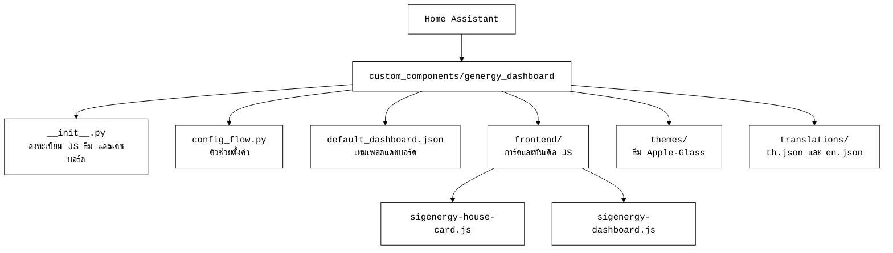

# Teerathap sigenergy

แดชบอร์ดพลังงานสำหรับ Home Assistant ที่ปรับสำหรับผู้ใช้ในประเทศไทย รองรับการ
ติดตามพลังงานแสงอาทิตย์ แบตเตอรี่ และการไฟฟ้า แสดงผลด้วยภาษาภาพแบบ Apple-Glass
(พื้นผิวกระจกฝ้าบนพื้นหลังโทนเข้ม สีเน้นอบอุ่นสีเดียว ฟอนต์ระบบ และตัวเลข
แบบ mono tabular) ข้อความทั้งหมดเป็นภาษาไทยและใช้สกุลเงินบาท

โปรเจกต์นี้เป็นงานดัดแปลง (fork) จาก
[SpengeSec/Genergy-Dashboard](https://github.com/SpengeSec/Genergy-Dashboard)
โดยเพิ่มการแปลภาษาไทย การปรับค่าให้เหมาะกับประเทศไทย และระบบดีไซน์ Apple-Glass

## คุณสมบัติหลัก

- การ์ดบ้านสามมิติพร้อมอนิเมชันการไหลของพลังงานแบบเรียลไทม์
- แผนภาพ Sankey แสดงการไหลพลังงานรายวัน
- การ์ดระบบแบตเตอรี่และสถานะกำลังไฟ
- กราฟพลังงานย้อนหลังพร้อมการพยากรณ์ (รองรับ EMHASS, HAEO, Energy Manager)
- ตั้งค่าผ่าน UI ไม่ต้องแก้ YAML
- ภาษาไทยทั้งหมด สกุลเงินบาท เกณฑ์ราคาตามสเกลไทย

## สถาปัตยกรรม

## การติดตั้ง

ต้องมีปลั๊กอิน frontend ของ HACS ดังนี้ ติดตั้งให้ครบก่อน

| ปลั๊กอิน | หน้าที่ |
|----------|---------|
| Layout Card | เลย์เอาต์แบบกริด |
| ApexCharts Card | กราฟพลังงาน |
| Mushroom | การ์ดสถานะ |
| card-mod | ฉีด CSS |
| Sankey Chart | แผนภาพการไหลพลังงาน |
| HTML Jinja2 Template Card | ตารางพยากรณ์ |

ขั้นตอน

1. คัดลอกโฟลเดอร์ `custom_components/genergy_dashboard` ไปที่ไดเรกทอรี
   `config/custom_components/` ของ Home Assistant
2. รีสตาร์ท Home Assistant
3. ไปที่ การตั้งค่า แล้วเพิ่มการผสานรวม ค้นหา Teerathap sigenergy
4. หากใช้อินเวอร์เตอร์ Sigenergy ให้เปิดสวิตช์เพื่อเติมเอนทิตีอัตโนมัติ

## เอกสารเพิ่มเติม

ดูรายละเอียดการแปลและการปรับค่าได้ที่ [docs/localization-th.md](docs/localization-th.md)

## เครดิตและสัญญาอนุญาต

โปรเจกต์ต้นฉบับ Genergy Dashboard โดย
[SpengeSec](https://github.com/SpengeSec/Genergy-Dashboard)

งานนี้เผยแพร่ภายใต้สัญญาอนุญาตเดียวกับต้นฉบับ คือ
Creative Commons Attribution-NonCommercial-ShareAlike 4.0 International
(CC BY-NC-SA 4.0)

- ต้องให้เครดิตผู้สร้างเดิม
- ห้ามใช้เพื่อการพาณิชย์
- งานดัดแปลงต้องใช้สัญญาอนุญาตเดียวกัน

ดูเนื้อหาสัญญาอนุญาตฉบับเต็มได้ที่ไฟล์ [LICENSE](LICENSE)
