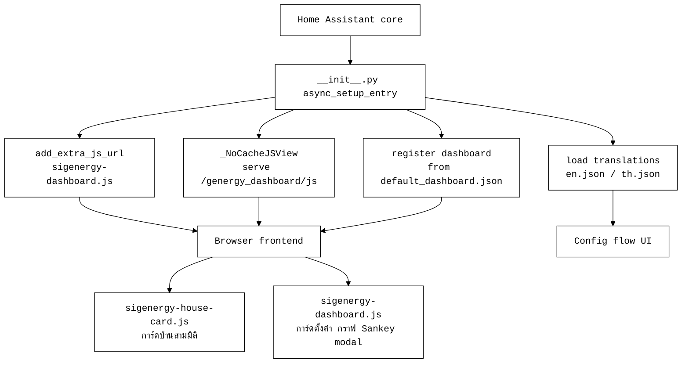
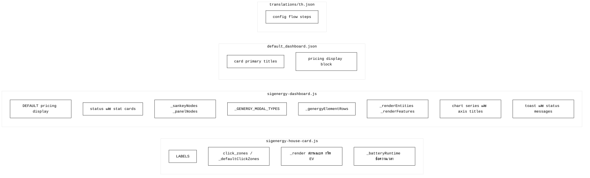
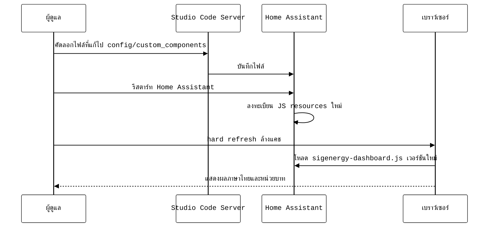
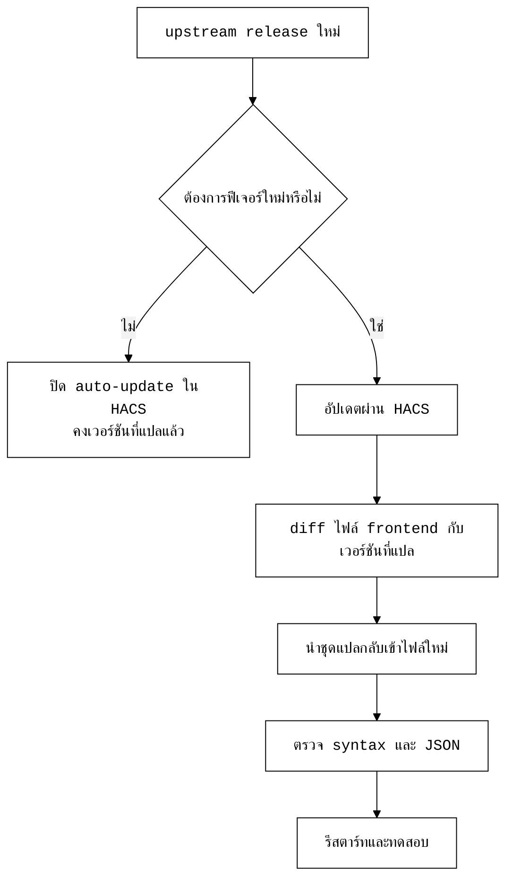
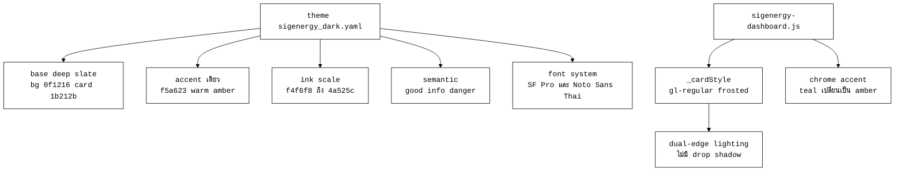

# เอกสารการแปลภาษาไทยและปรับค่าให้เหมาะกับประเทศไทย (Genergy Dashboard)

เอกสารนี้อธิบายขอบเขตการแก้ไข สถาปัตยกรรมการโหลดไฟล์ ตำแหน่งของข้อความที่แปล
และขั้นตอนการนำขึ้นใช้งานบน Home Assistant สำหรับผู้ที่ต้องดูแลรักษาโค้ดต่อ

## 1. ขอบเขตงาน

- แปลข้อความที่ผู้ใช้มองเห็นทั้งหมดบนหน้า Overview เป็นภาษาไทย
- แปล UI ตั้งค่า (Settings) ส่วนหลัก ได้แก่ ชื่อแท็บ หัวข้อส่วน ป้ายเอนทิตี
  สวิตช์ฟีเจอร์ ปุ่ม และข้อความแจ้งสถานะ
- เปลี่ยนสกุลเงินจากยูโรเป็นบาท ทั้งสัญลักษณ์และค่าตั้งต้น
- ปรับเกณฑ์ราคาค่าไฟให้อยู่ในสเกลของประเทศไทย
- เพิ่มไฟล์แปลของตัวช่วยตั้งค่า (config flow) เป็นภาษาไทย

ศัพท์เฉพาะที่คงไว้เป็นภาษาอังกฤษโดยเจตนา ได้แก่ EMHASS, HAEO, MPC, Nordpool,
SoC, HVAC, PV เนื่องจากเป็นชื่อเฉพาะหรือมาตรฐานสากล

## 2. สถาปัตยกรรมการโหลดไฟล์ของส่วนขยาย

ส่วนขยายให้บริการไฟล์ frontend ทั้งหมดจากไดเรกทอรี `frontend/` ไม่ใช่ `dist/`
จุดลงทะเบียนทรัพยากรอยู่ใน `__init__.py` ผ่าน `add_extra_js_url` และ
`_NoCacheJSView` ดังนั้นการแก้ไขต้องทำที่ `frontend/` เท่านั้น ส่วน `dist/`
เป็นไฟล์โหมดปลั๊กอินแบบเดิมที่ไม่ถูกใช้งาน



## 3. ไฟล์ที่แก้ไข

ตารางสรุปไฟล์ที่เปลี่ยนแปลง ขอบเขต และผลที่ผู้ใช้เห็น

| ไฟล์ | ขอบเขตการแก้ไข | ผลต่อผู้ใช้ |
|------|----------------|------------|
| `frontend/sigenergy-house-card.js` | ป้ายบนบ้าน สถานะ และข้อความเวลาใช้งานแบตเตอรี่ | ป้ายและสถานะบนการ์ดบ้านเป็นไทย |
| `frontend/sigenergy-dashboard.js` | การ์ดสถานะ กราฟ โหนด Sankey modal UI ตั้งค่า สกุลเงิน และเกณฑ์ราคา | ทุกข้อความบนหน้าหลักและตั้งค่าเป็นไทย แสดงหน่วยบาท |
| `default_dashboard.json` | หัวข้อการ์ดตั้งต้น ธีม หน่วย และเกณฑ์ราคา | แดชบอร์ดที่สร้างใหม่เป็นไทยและธีมมืด |
| `translations/th.json` | ไฟล์ใหม่ สำหรับตัวช่วยตั้งค่า | หน้าตั้งค่าตอนเพิ่มส่วนขยายเป็นไทย |

## 4. แผนผังตำแหน่งข้อความที่แปล

ไดอะแกรมต่อไปนี้จับคู่ส่วนของ UI กับฟังก์ชันหรือบล็อกข้อมูลที่เป็นแหล่งข้อความ
ใช้เป็นจุดอ้างอิงเวลาต้องแก้ไขเพิ่มเติม



## 5. การแปลงสกุลเงินและเกณฑ์ราคา

ค่าตั้งต้นเดิมอ้างอิงตลาดยุโรป (ยูโร, สเกลราคา 0.10 ถึง 0.25 ต่อ kWh)
ปรับเป็นบาทและสเกลของไทยดังนี้

| รายการ | ค่าเดิม | ค่าใหม่ |
|--------|---------|---------|
| สัญลักษณ์สกุลเงิน | EUR | THB |
| เกณฑ์ราคาถูก (cheap_threshold) | 0.10 | 3.0 |
| เกณฑ์ราคาแพง (expensive_threshold) | 0.25 | 4.5 |
| แหล่งราคาตั้งต้น (source) | nordpool | custom |

หมายเหตุ ค่าเกณฑ์ราคาเป็นค่าตั้งต้นสำหรับการสร้างแดชบอร์ดใหม่ ผู้ใช้ปรับได้
ภายหลังที่แท็บ ราคาค่าไฟ ในการ์ดตั้งค่า

## 6. ขั้นตอนการนำขึ้นใช้งาน



ไฟล์ที่ต้องคัดลอกไปทับ ภายใต้ `config/custom_components/genergy_dashboard/`

```
frontend/sigenergy-house-card.js
frontend/sigenergy-dashboard.js
default_dashboard.json
translations/th.json
```

## 7. การดูแลรักษาเมื่อ upstream ออกเวอร์ชันใหม่

การอัปเดตส่วนขยายผ่าน HACS จะเขียนทับไฟล์ที่แก้ไว้ทั้งหมด แนวทางจัดการ



แนวทางที่แนะนำคือเก็บชุดข้อความแปลเป็นคู่ค้นหาแทนที่ (mapping) เพื่อให้นำกลับเข้า
ไฟล์เวอร์ชันใหม่ได้รวดเร็ว และตรวจสอบทุกครั้งด้วย `node --check` สำหรับไฟล์ JS และ
`JSON.parse` สำหรับไฟล์ JSON ก่อนนำขึ้นใช้งาน

## 8. รายการตรวจสอบก่อนส่งมอบ

| ขั้นตอน | คำสั่งหรือวิธี | เกณฑ์ผ่าน |
|---------|----------------|-----------|
| ตรวจไวยากรณ์ JS | `node --check <file>.js` | ไม่มี error |
| ตรวจความถูกต้อง JSON | `node -e "JSON.parse(...)"` | parse ได้ |
| ตรวจสัญลักษณ์ยูโรตกค้าง | ค้นหา `€` และ `EUR` | ไม่พบ |
| ตรวจการแสดงผลจริง | เปิดแดชบอร์ดหลังรีสตาร์ท | ข้อความเป็นไทย หน่วยบาท |

## 9. การรีแบรนด์และระบบดีไซน์ Apple-Glass

ส่วนขยายถูกรีแบรนด์เป็น Teerathap sigenergy และปรับภาษาภาพให้เป็นแนว
Apple-Glass (frosted glass บนพื้นหลังโทนเข้ม ใช้สีเน้นอบอุ่นเพียงสีเดียว
ฟอนต์ระบบ และตัวเลข mono tabular)

### 9.1 จุดที่เปลี่ยนชื่อแบรนด์

| ไฟล์ | คีย์ | ค่าใหม่ |
|------|------|---------|
| `const.py` | `DASHBOARD_TITLE` | Teerathap sigenergy |
| `manifest.json` | `name` | Teerathap sigenergy |
| `config_flow.py` | `title` ทั้งสามขั้น | Teerathap sigenergy |
| `strings.json` / `translations/th.json` | หัวข้อขั้น user | Teerathap sigenergy |

### 9.2 ไอคอน

รูปต้นฉบับถูกครอปเป็นสี่เหลี่ยมจัตุรัสแล้วย่อเป็นหลายขนาดเพื่อใช้เป็น
ไอคอนของส่วนขยาย และวางสำเนาไว้ในโฟลเดอร์ที่ให้บริการเพื่อใช้ตกแต่งภายใน UI

| ปลายทาง | ขนาด | การใช้งาน |
|---------|------|-----------|
| `brand/icon.png` `brand/icon@2x.png` | 256 / 512 | ไอคอนใน Devices and Services |
| `brand/dark_icon.png` `brand/dark_icon@2x.png` | 256 / 512 | ไอคอนโหมดมืด |
| `icon.png` | 256 | ไอคอนส่วนขยาย |
| `frontend/images/teerathap-logo.png` | 512 | โลโก้สำหรับใช้ภายในหน้าจอ |
| `hacs_icon.png` | 256 | ไอคอนใน HACS |

หมายเหตุ แถบเมนูด้านข้างของ Home Assistant รองรับเฉพาะไอคอนชุด mdi
ไม่รองรับรูปภาพกำหนดเอง จึงยังใช้ไอคอน mdi สำหรับรายการในแถบเมนู

### 9.3 โทเคนระบบดีไซน์



### 9.4 หลักการที่บังคับใช้

| หลักการ | การนำไปใช้ |
|---------|------------|
| สีเน้นเดียว | เปลี่ยนสีเน้น chrome จาก teal เป็น amber f5a623 คงสีเข้ารหัสข้อมูลไว้ |
| frosted glass | `_cardStyle` ใช้พื้นโปร่งแสง blur 28px saturate 1.6 |
| ไม่มี drop shadow บนการ์ด | ใช้ขอบ hairline กับแสง inset แทน |
| ตัวเลข mono tabular | บังคับ `tabular-nums` กับค่าตัวเลขรอง |
| ฟอนต์ระบบ | นำ SF Pro แล้วตามด้วย Noto Sans Thai |
| ไม่มีอิโมจิในโค้ด | ลบอิโมจิออกจากโค้ดและข้อความที่เขียนใหม่ |
